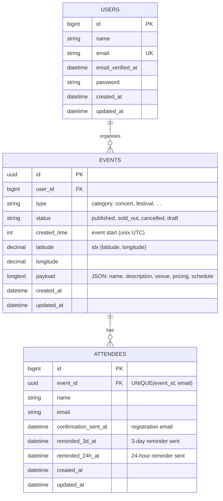

# Database structure (ERD)

The diagram below renders automatically on GitHub (Mermaid). It shows the domain
tables relevant to the coding test and how they relate. Laravel's framework tables
(`sessions`, `cache`, `jobs`, `password_reset_tokens`, `passkeys`, …) are omitted
for clarity — they aren't part of the event domain.

## Relationships

| From | To | Type | Notes |
| --- | --- | --- | --- |
| `users` | `events` | one-to-many | `events.user_id → users.id`, cascade on delete. The event organiser. |
| `events` | `attendees` | one-to-many | `attendees.event_id → events.id`, cascade on delete. The attendee list. |

Eloquent: `Event::user()` / `Event::attendees()`, `Attendee::event()`.

## Indexes

| Table | Index | Purpose |
| --- | --- | --- |
| `events` | `(status)` | original — listing by status |
| `events` | `(created_time)` | **added** — date-range filtering on the feed |
| `events` | `(latitude, longitude)` | **added** — location bounding-box filtering |
| `attendees` | `UNIQUE(event_id, email)` | **added** — one registration per email per event (duplicate prevention) |

## Table / relationship review against the coding test

| Requirement | How it's modelled | Schema change? |
| --- | --- | --- |
| Events with title/description/location/date | `events` table; title/description/venue/pricing live in `payload` (as seeded) | none — used as provided |
| **Images** (2+ per event, local) | Resolved deterministically from `events.id` + `events.type` to a local file pool (`App\Support\EventImages`). No table — every event reuses the shared placeholder pool, so 2.5M+ image rows would add cost without changing behaviour. | **none, by design** (see [DECISIONS.md](../DECISIONS.md)) |
| **Addresses** (lat/lng → readable) | Derived at read time by offline nearest-anchor reverse geocoding (`App\Support\Geocoder`). No table — it's a pure function of the coordinates. | none, by design |
| **Date/time + timezones** | `events.created_time` (unix UTC) + venue timezone derived from the resolved city. | none |
| **Filtering** (date + location) | New indexes on `created_time` and `(latitude, longitude)`. | indexes added |
| **Attendees / interest list** | New `attendees` table. | **table added** |
| **Confirmation + reminder emails** | `attendees.confirmation_sent_at`, `reminded_3d_at`, `reminded_24h_at` track sends so the scheduler is idempotent. | columns added |
| **Duplicate prevention** | `UNIQUE(event_id, email)` + idempotent `firstOrNew`. | unique index added |

**Conclusion:** the only new table the coding test requires is `attendees` (plus the
reminder-tracking columns and the supporting indexes). Images and addresses are
intentionally derived rather than stored — see DECISIONS.md for the reasoning.

## Inspecting the live database

Any SQLite client can open `database/database.sqlite` to browse the schema visually:

- **TablePlus / DBeaver / DataGrip** → "Open database" → point at the `.sqlite` file.
- **VS Code** → the "SQLite Viewer" or "SQLite" extension.
- **CLI** → `sqlite3 database/database.sqlite ".schema"` (or `.tables`).
- **Artisan** → `php artisan db:show` and `php artisan db:table attendees`.
